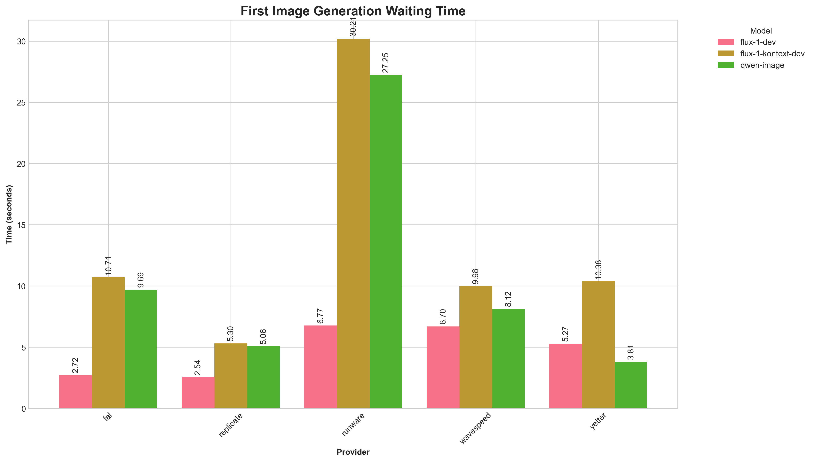
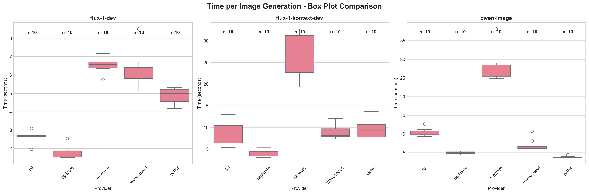
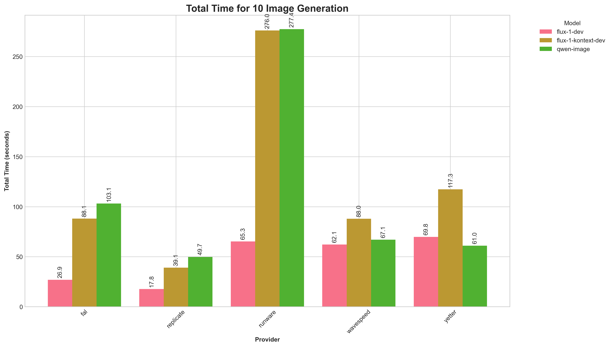

## Yetter AI (ytr-ai) Image Generation

End-to-end examples for three Yetter AI image models, with both single-run and batch workflows:

- **Flux 1 Dev (Text-to-Image)**: `ytr-ai/flux/v1.0-dev/t2i`
- **Flux 1 Kontext (Image-to-Image Edit)**: `ytr-ai/flux/v1.0-dev/i2i/kontext`
- **Qwen Image (Text-to-Image)**: `ytr-ai/qwen/image/t2i`

You can run each model in two ways:

- `index.js`: generate a single job (supports subscribe or streaming)
- `batch-generate.js`: generate many jobs from prompt files (and paired images for edits)


## Prerequisites

- Node.js 18+ recommended
- Install dependencies in the repository root:

```bash
npm install
```

- For using Yetter AI API in your own projects:

```bash
npm install --save @yetter/client
```

- Set your API key (either works):

```bash
export YTR_API_KEY="your_api_key_here"
# or
export REACT_APP_YTR_API_KEY="your_api_key_here"
```


## Project layout

- `flux-1-dev/` — Flux Dev t2i examples
  - `index.js`, `batch-generate.js`, `results/`
- `flux-1-kontext-dev/` — Flux Kontext i2i editing examples
  - `index.js`, `batch-generate.js`, `results/`
- `qwen-image/` — Qwen t2i examples
  - `index.js`, `batch-generate.js`, `results/`
- `prompts.txt` — prompts for t2i batch scripts
- `edit-prompts.txt`, `edit-images/` — edit prompts and source images for i2i batch script


## When to use each model

- **Flux 1 Dev (t2i)** — fast, balanced text-to-image for prototyping and iteration.
  - Default params favor speed/quality balance: `num_inference_steps: 28`, `guidance_scale: 3.5`.
- **Flux 1 Kontext (i2i/kontext)** — image editing with an input image and an edit prompt.
  - Tuned for edits: `guidance_scale: 2.5`, plus `image_url` and optional `resolution_mode`.
- **Qwen Image (t2i)** — text-to-image with higher step defaults for detailed images.
  - Defaults emphasize detail: `num_inference_steps: 50`, `guidance_scale: 4.0`, supports `negative_prompt`.


## Parameters by model (defaults from code)

### Flux 1 Dev — `ytr-ai/flux/v1.0-dev/t2i` (folder `flux-1-dev`)
- `prompt` (string) — required
- `image_size` (string) — default: `"square_hd"`
- `num_inference_steps` (number) — default: `28`
- `guidance_scale` (number) — default: `3.5`
- `seed` (number | null) — optional (used in batch example)
- `num_images` (number) — default: `1`
- `enable_safety_checker` (boolean) — default: `false`
- `sync_mode` (boolean) — default: `false`
- `acceleration` (string) — default: `"none"`
- `streaming` (boolean) — default: `false`

### Flux 1 Kontext — `ytr-ai/flux/v1.0-dev/i2i/kontext` (folder `flux-1-kontext-dev`)
- `image_url` (string) — required (local file is auto-converted to data URL)
- `prompt` (string) — required
- `num_inference_steps` (number) — default: `28`
- `guidance_scale` (number) — default: `2.5`
- `seed` (number | null) — optional (used in batch example)
- `num_images` (number) — default: `1`
- `enable_safety_checker` (boolean) — default: `false`
- `sync_mode` (boolean) — default: `false`
- `acceleration` (string) — default: `"none"`
- `resolution_mode` (string) — default: `""` (optional)
- `streaming` (boolean) — default: `false`

### Qwen Image — `ytr-ai/qwen/image/t2i` (folder `qwen-image`)
- `prompt` (string) — required
- `image_size` (string) — default: `"square_hd"`
- `num_inference_steps` (number) — default: `50`
- `guidance_scale` (number) — default: `4.0`
- `num_images` (number) — default: `1`
- `enable_safety_checker` (boolean) — default: `false`
- `sync_mode` (boolean) — default: `false`
- `negative_prompt` (string) — default: `""`
- `streaming` (boolean) — default: `false` in subscribe example, `true` in stream path


## How to use: single run (`index.js`)

### Flux 1 Dev (t2i)
```bash
node flux-1-dev/index.js "a beautiful landscape at sunset"            # subscribe mode
node flux-1-dev/index.js "a futuristic cityscape" --stream             # streaming mode (SSE)
```

Output: logs + a result object in stdout; save images yourself or use the batch script for auto-saving.

### Flux 1 Kontext (i2i edit)
```bash
# With a local image (auto-converted to data URL)
node flux-1-kontext-dev/index.js edit-images/image_01.jpg "make colors more vibrant"

# Or with a remote URL
node flux-1-kontext-dev/index.js "https://example.com/pic.jpg" "convert to watercolor style" --stream
```

Output: logs + a result object in stdout. For automatic saving and reporting, use the batch script.

### Qwen Image (t2i)
```bash
node qwen-image/index.js "photorealistic bowl of ramen, soft bokeh"    # subscribe mode
node qwen-image/index.js "cyberpunk street, neon, rain" --stream       # streaming mode (SSE)
```


## How to use: batch generation (`batch-generate.js`)

### Flux 1 Dev (t2i) — prompts from `prompts.txt`
1) Add one prompt per line to `prompts.txt` (a starter file is included).
2) Run:

```bash
node flux-1-dev/batch-generate.js
```

Artifacts:
- Images => `flux-1-dev/results/prompt_XX_image_1.webp`
- JSON => `flux-1-dev/results/batch_results.json`
- Markdown summary => `flux-1-dev/results/summary_report.md`

Defaults applied in code: `image_size: "square_hd"`, `num_inference_steps: 28`, `guidance_scale: 3.5`, `seed: 42`, `num_images: 1`.

### Flux 1 Kontext (i2i edit) — pairs `edit-prompts.txt` with `edit-images/`
1) Put source images into `edit-images/` (`.jpg`, `.jpeg`, `.png`, `.webp`).
2) Put matching edit prompts in `edit-prompts.txt` (one per line). The script pairs items by sorted order and uses the smaller count of the two lists.
3) Run:

```bash
node flux-1-kontext-dev/batch-generate.js
```

Artifacts:
- Images => `flux-1-kontext-dev/results/edit_XX_<original>_result_1.webp`
- JSON => `flux-1-kontext-dev/results/batch_results.json`
- Markdown summary => `flux-1-kontext-dev/results/summary_report.md`

Defaults applied in code: `num_inference_steps: 28`, `guidance_scale: 2.5`, `seed: 42`, `num_images: 1`.

### Qwen Image (t2i) — prompts from `prompts.txt`
1) Add prompts to `prompts.txt`.
2) Run:

```bash
node qwen-image/batch-generate.js
```

Artifacts:
- Images => `qwen-image/results/prompt_XX_image_1.webp`
- JSON => `qwen-image/results/batch_results.json`
- Markdown summary => `qwen-image/results/summary_report.md`

Defaults applied in code: `image_size: "square_hd"`, `num_inference_steps: 50`, `guidance_scale: 4.0`, `num_images: 1`, `negative_prompt: ""`.


## Programmatic usage (inside Node.js)

You can import and call the helpers directly.

```javascript
// Flux Dev (t2i)
import { generateImage as generateFlux } from "./flux-1-dev/index.js";
const result = await generateFlux("a serene mountain lake", { num_inference_steps: 32 });

// Flux Kontext (i2i edit)
import { generateEditedImage, imageToDataURL } from "./flux-1-kontext-dev/index.js";
const imageUrl = await imageToDataURL("./edit-images/image_01.jpg");
const edited = await generateEditedImage(imageUrl, "add watercolor style", { guidance_scale: 2.0 });

// Qwen Image (t2i)
import { generateImage as generateQwen } from "./qwen-image/index.js";
const qwen = await generateQwen("illustration of a dragon under starry sky", { negative_prompt: "low quality" });
```


## Provider comparison and performance (plots)

This repo includes a small control-group to compare Yetter AI's managed API against several provider wrappers using the same model families. Results are summarized in `plots/` and were generated from the batch scripts in `model/` (Yetter) and `control_group/` (other providers).

### What the providers are
- **Yetter AI (this repo's `model/` folder)**: Direct, managed API with tuned defaults and optimized routing. Designed for consistent latency and simple DX (streaming or subscribe flows).
- **FAL / Replicate / Runware / Wavespeed (under `control_group/`)**: Third‑party execution layers that host or route to similar models. Behavior can differ due to their queueing, cold starts, concurrency, and streaming mechanics.

### How to read the plots
- **First image waiting time**: Time from job submission to the first completed image. Lower is better.
- **Time per image (boxplot)**: Distribution of per‑image latencies across a 10‑prompt batch. Narrower boxes indicate more consistent performance.
- **Total time for 10 images**: End‑to‑end wall‑clock time to process a 10‑prompt batch. Lower is better.

### Results at a glance (focus on Yetter)
- In our runs captured here, **Yetter** consistently showed:
  - **Lower time‑to‑first‑image**,
  - **More stable per‑image times** (tighter distribution), and
  - **Lower total time** to complete the 10‑image batch.

Your results may vary depending on network, region, model settings, and provider account limits.







### Reproduce these plots
1) Install dependencies and set required API keys (e.g., `YTR_API_KEY` for Yetter; set credentials for other providers as needed).

```bash
npm install

# Example: run Flux 1 Dev (t2i) batches across providers
node model/flux-1-dev/batch-generate.js
node control_group/fal/flux-1-dev/batch-generate.js
node control_group/replicate/flux-1-dev/batch-generate.js
node control_group/runware/flux-1-dev/batch-generate.js
node control_group/wavespeed/flux-1-dev/batch-generate.js

# Optionally run the i2i (kontext) and qwen-image variants, too

# Generate summary plots
python3 visualize_performance.py
# or
bash run_analysis.sh
```


## Tips and troubleshooting

- **API key errors**: Ensure `YTR_API_KEY` or `REACT_APP_YTR_API_KEY` is exported in your shell before running scripts.
- **Missing output files**: Check logs for errors, and confirm the `results/` directory was created.
- **Slow generations**: Lower `num_inference_steps`; Flux Dev is generally fastest for iteration.
- **Reproducibility**: Provide a `seed` value in options (used in batch examples) to reduce randomness.


## Model IDs used in code

- Flux Dev (t2i): `ytr-ai/flux/v1.0-dev/t2i` in `flux-1-dev/index.js`
- Flux Kontext (i2i): `ytr-ai/flux/v1.0-dev/i2i/kontext` in `flux-1-kontext-dev/index.js`
- Qwen Image (t2i): `ytr-ai/qwen/image/t2i` in `qwen-image/index.js`